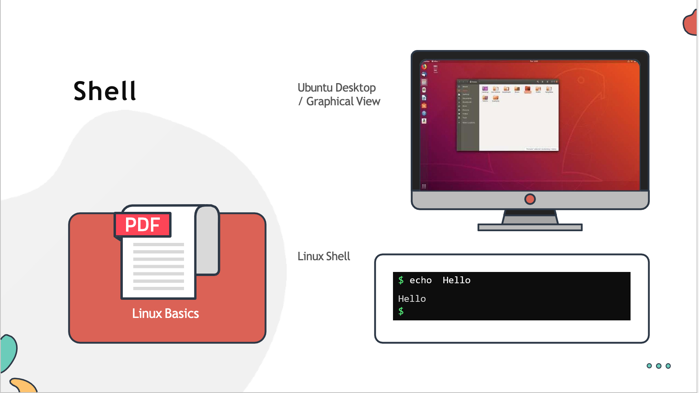
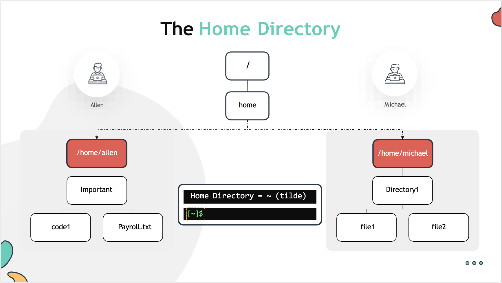
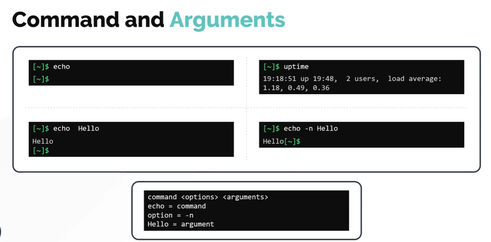
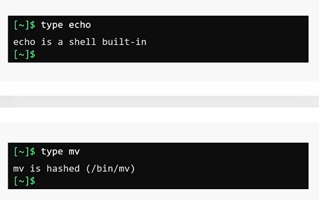

# Working with the shell - I

In this section, we will take a look at linux shell in detail. 
- We will learn how to use linux commands and understand how to work with files and directories. 
- We will also see different ways to get help with linux commands. 
- Finally, we will learn about different types of shells used in Linux (particulary focusing on the bash shell)

#### Linux shell



- This command line interface (CLI) will enable you to effectively work on linux laptop/server/virtual machine.
- While the graphical version may see more appealing to the users but can be limited in case of functionality. These is where the Linux command line commonly known as **`Linux Shell`** shines.

  #### What is a shell?

  - Linux shell is a program that allows text based interaction between the user and the operating system, this interaction is carried out by typing commands into the interface and receving the response in the same way.
  - The Linux shell is a powerful tool with which you can navigate between different locations within the system, however when you login to the shell the very first directory you were take into is your home directory.

#### The Home Directory


 
- A user **`michael`** home directory created under **`/home/michael`**, where **`/home`** is a system created home directory that contains the home directories for almost all users in the linux system. 
- The name of the home directory is by default identical to the name of the user, hence **`michael's`** home directory is **`/home/michael`**.
- Remember the home directory is unique for each user. Another user called **`allen`** will have a different home directory which by default created under **`/home/allen`**.

  ##### Why do we need a home directoy?
  - The home directory allows users to store their personal data in the form of files and directories
  - Each user in the system gets their own unique home directory with complete access to it (to be able to save, retreive , delete data).
  - Think of it as a dedicated locker assign to you in which you can store or retreive items.
  - Other users can't access your files and folders with in your home directory (only you can).

**Note** : The representation of the home directory is represented as by the `~ (tilde symbol).`

#### Command Prompt

- You can configure the command prompt to show whatever you want, such as the **`hostname`** , **`date`** or **`time`**. 
- It is currently configured to show the current working directory. The **`~` symbol**  here represents the home directory

#### Command and Arguments

- To interact with the linux system using the shell, a user has to type in commands
- When a command is run it executes a program to achieve a specific task.
  - **`For example`**: The **`echo`** command is used to print a line of text on the screen.
  ```
                          $ echo 
  ```
- An argument acts as an input to command
  - **`For example`**: To print a **`hello`** message type **`echo hello`** command.
  ```
                          $ echo hello
  ```
- There are several commands that can work without an argument too.
  - **`For example`**: Type in the command called **`uptime`**, this is used to print information about how long a system has been running for since the last reboot along with the other information (This command doesn't need an argument)
  ```
                          $ uptime 
  ```
- A command can also have options that modify its behaviour in some predetermine way. The option also sometime referred to as a switch or a flag 
  - **`For example`**: To print a same word `hello` but without a trailing line, use **`echo`** command with **`-n`** flag.
  ```
                          $ echo -n hello
  ```
  


#### Command Types

Command types in linux can be generally categorized in two types
 1. Internal or Built-in Commands 
    - Internal commands are part of the shell itself. It come bundled with it, there are in total about 30 such commands
    - **`For example`**: echo, cd, pwd, set e.t.c.
 1. External Commands
    - External commands on the other hand are binary programs or scripts which are usually located in distinct files in the system. They either come with pre-install with the distribution package manager or can be created or installed by the user
    - **`For Example`**: mv, date, uptime, cp e.t.c.
    
To determine a command is internal or external, use **`type`** command
 

