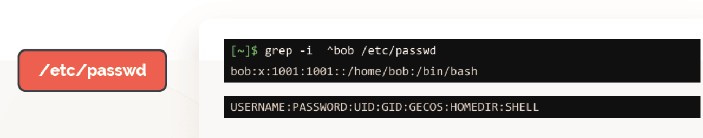
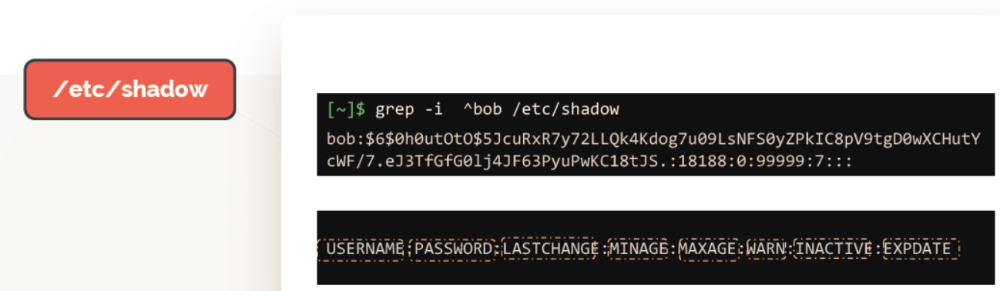
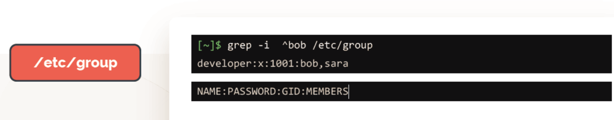

# ACCESS CONTROL FILES
 
  - Access Ccontrol files are stored under **`/etc`**.
  - Can be read by anyone and can be only edited by **`root`** user.


  ### Control files

  - To get more details about one's account for example **`salman`** account, home director, uid, and shell check **`/etc/passwd`** 

    ```
    [~]$ grep -i ^salman /etc/passwd
    salman:x:1002:1002::/home/salman:/bin/sh
    USERNAME:PASSWORD:UID:GID:GECOS:HOMEDIR:SHELL
    ```
   
    

  - Password are stored under **`/etc/shadow`**

    ```
    [~]$ grep -i ^salman /etc/shadow
    salman:$6$0h0utOtO$5JcuRxR7y72LLQk4Kdog7u09LsNFS0yZPkIC8pV9tgD0wXCHutY
    cWF/7.eJ3TfGfG0lj4JF63PyuPwKC18tJS.:18188:0:99999:7:::

    USERNAME:PASSWORD:LASTCHANGE:MINAGE:MAXAGE:WARN:INACTIVE:EXPDATE
    ```

    

  - Check the groups **`salman`** belongs too

    ```
    [~]$ grep -i ^salman /etc/group
    NAME:PASSWORD:GID:MEMBERS
    ```

    

