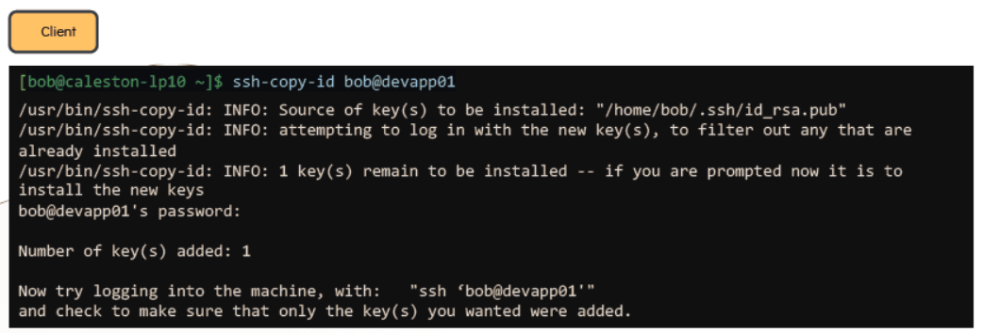

# SSH and SCP

  - In this lecture we will learn about SSH and SCP commands.
  - SSH is used to login to the remote computer.
  - SCP is used to copy of files/directories within the file system also can copy data to remote computer.

  #### SSH

  - To login to the remote server use **`ssh`** command with hostname or IP address.

    ```
    ssh <hostname OR IP Address>
    ```

  - To login to the remote server with specific username and password.

    ```
    ssh <user>@<hostname OR IP Address>
    ```

    **`-l`** attribute can also be used as 

    ```
    ssh –l <user> <hostname OR IP Address>
    ```

  #### Password-Less Authentication

  - Passwordless authentication can be setup via key-pair authentication in order to login to the remote server with password.

  - Public and Private key are stored at below location.
    
    ```
    Public Key: /home/salman/.ssh/id_rsa.pub
    ```

    ```
    Private Key: /home/salman/.ssh/id_rsa
    ```

  - To generate a keypair on the **`Client`** run this command

    ```
    salman@server1 ~]$ ssh-keygen –t rsa
    ```

    

  - To copy the Public key from the client to the remote server

    ```
    salman@server1 ~]$ ssh-copy-id salman@server2
    ```

    

 
  - Now **`salman`** can login to remote server without password

    ```
    [salman@server1 ~]$ ssh server2
    ```

    

  - Public Key is copied to the remote server at :

    ```
    [salman@server1 ~]$ cat /home/salman/.ssh/authorized_keys
    ```
   
    

  #### SCP

   - To copy a compresses file to a remote server

     ```
     salman@server1 ~]$ scp /home/salman/salman-code.tar.gz server2:/home/salman
     ```
 
   - To copy a directory to a remote server

     ```
     [salman@server1 ~]$ scp –pr /home/salman/media/ server2:/home/salman
     ```
     
     